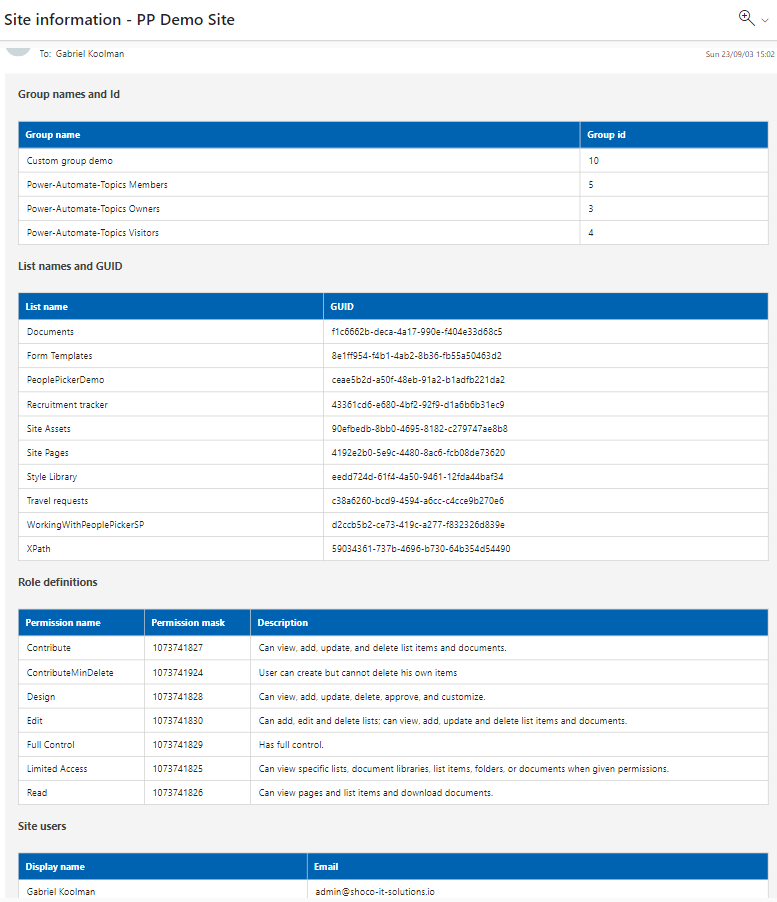

# Get SharePoint Site Information

## Summary

This sample flow calls SharePoint REST API to collect site-related details including list names and GUIDs, sharepoint group names and IDs, names and email  addresses of site users, and lastly, all permission masks. These data will be mapped and send back to the user by email and presented in HTML tables.




## Applies to

* [Microsoft Power Automate](https://docs.microsoft.com/power-automate/)

## Compatibility


## Authors

Solution|Author(s)
--------|---------
get-sharepoint-site-information | [Gabriel Koolman](https://www.linkedin.com/in/gabrielkoolman/)

## Version history

Version|Date|Comments
-------|----|--------
1.0|September 3, 2023|Initial release

## Minimal Path to Awesome

* [Download](solution/get-sharepoint-site-information.zip) the `.zip` from the `solution` folder
* [Import](https://flow.microsoft.com/en-us/blog/import-export-bap-packages/) the `.zip` file using **My Flows** > **Import** > **Upload** within Microsoft Flow.
* After downloading and importing the flow, proceed to open the flow and expand the **Compose** action named **'Settings'** and replace the **siteUrl** property with your own siteUrl.

## Using the Source Code

You can also use the [Power Apps CLI](https://docs.microsoft.com/powerapps/developer/data-platform/powerapps-cli) to pack the source code by following these steps::

* Clone the repository to a local drive
* Pack the source files back into a solution `.zip` file:
  ```bash
  pac solution pack --zipfile pathtodestinationfile --folder pathtosourcefolder --processCanvasApps
  ```
  Making sure to replace `pathtosourcefolder` to point to the path to this sample's `sourcecode` folder, and `pathtodestinationfile` to point to the path of this solution's `.zip` file (located under the `solution` folder)
* Within **Power Automate Studio**, import the `.zip` file using **My Flows** > **Import** > **Upload** within Microsoft Flow.

## Disclaimer

**THIS CODE IS PROVIDED *AS IS* WITHOUT WARRANTY OF ANY KIND, EITHER EXPRESS OR IMPLIED, INCLUDING ANY IMPLIED WARRANTIES OF FITNESS FOR A PARTICULAR PURPOSE, MERCHANTABILITY, OR NON-INFRINGEMENT.**